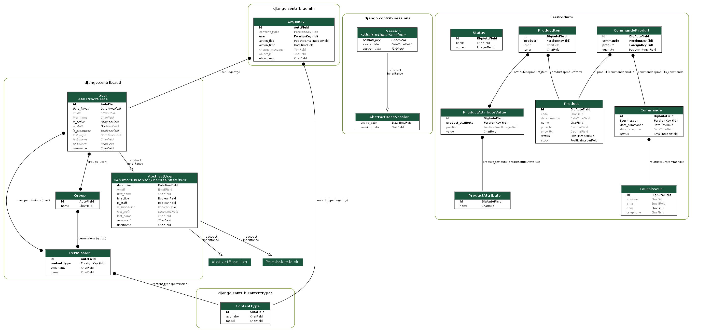

# Django Rémi Boulay et Kris Toure

## Lien de la vidéo de la présentation de l'application
https://youtu.be/wzGLFflaKtk

## Comment lancer l'application ?
1. Sur Windows
```PowerShell
cd '.\TD1 2\'
python -m venv venv
.\venv\Scripts\activate
pip install -r requirements.txt
cd GestionProduit
./manage.py runserver
```

<br>

2. Sur Linux

```PowerShell
cd '.\TD1 2\'
python -m venv venv
source venv/bin/activate
pip install -r requirements.txt
cd GestionProduit
./manage.py runserver
```

<br>

3. La base de données

Aucune manipulation est nécessaire pour avoir la base de données, elle est déjà présente dans le dépôt GitHub pour avoir le moins de commandes possible à réaliser

## Les tests

A cause de problèmes techniques concernant Kris, les tests ne sont pas réalisés à 100%.
il a eut 13 tests de réaliser et qui passe.
(Les détails des problèmes sont que Kris n'a plus de compte GitHub fonctionnel. Sur 2 comptes, un n'est plus accessible à cause de l'A2F et l'autre n'a pas la possibilité de faire des manipulations comme sur le dépôt distant)

## MCD

